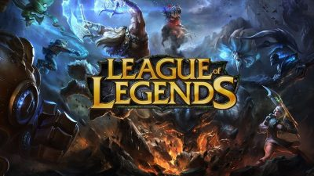
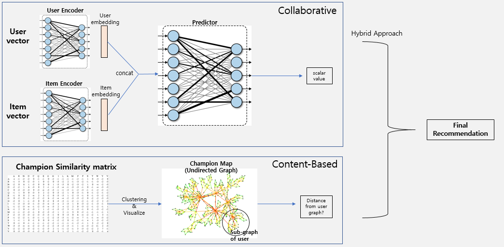

# KSE643 MadHatter Project

## Introduction



In this project, we build a recommender system for [League of Legends](https://kr.leagueoflegends.com/). In League of Legends (in short, **LOL**), there are huge number of **144** champions currently. Users select their own champion to play the LOL, but there are so many champions to choose, it is hard to find suitable champion based on their own play style.

Therefore, we've decided to build a recommonder system for such users who struggle to find champions. Especially, we want to recommend the most suitable champion in respect to user's play style based on their play history. 

## System Requirement

- Anaconda based on Python 3.7
- PyTorch >= 1.0.0
- urllib
- BeautifulSoup

## How to Use

To get a recommended champion, you just need to execute `main.py` file. 

```
python3 main.py

(In Program)
Enter user name> <user name>
```

## Data Collecting

To build our recommender system, we need to collect our data. We collect users in rank between silver and gold, and get the top-7 played champions and their play count and win rate. These are done in following codes.

- `data_collector.py`
- `Models/DataCollector.py`

Data collected from this code is saved in *data_batch* directory.

Then, to ease our code for loading these data, `batch_merger.py` is used, and result is saved as `userbatch.json` in *data_batch* directory.

*metadata* directory contains mapping of champion name and id. These IDs are managed in Riot Games, developer of LOL.

## Architecture

This is our overall architecture.



We design our recommender system using hybrid approach. In collaborative filtering, we use user's top 7 play count for champions. And in content-based filtering, we use champion's similarity. The implementation details are given below

1. **Collaborative Filtering Part**

    - `vector_generator.py`

        First, we make our own user vectors in this code. This is done in `UserVectorGenerator` class. User vectors are consist of TF-IDF value of play count. For each user. we first collect top 7 played champions. Then, we intentionally delete one champion from list of 7 champions. The win rate of this deleted champion becomes label for our learning model. Therefore, we can create 7 virtual users for each user. This operation is done in `_get_play_count_vector()` method in this code.

        Second, we make also item vectors. This is done in `ItemVectorGenerator` class. In this case, we collect overall play count for each champion from our datasets. Then, using overall win rate for each champion, we compute TF-IDF value. Then, we generate similarity matrix between champion using cosine similarity. This operation is done in `_get_play_count_tf_idf()` and `_get_champ_corr_matrix()` method.

        Generated vectors are saved in *datasets* directory

    - `Models/Models.py`

        This file contains actual learning model of our collaborative filtering. We use Autoencoder for this project. And there is also `Predictor`, which predicts win rate for recommened champion for each user.

    - `user_encoder.py` and `item_encoder.py`

        These are scripts for generating model using user vectors and item vectors. These train Autoencoder for each vectors.

2. **Content-based Filtering Part**

    - `undirected_graph.py`

        In content-based filtering, we utilize graph structure. Each node is champion and nodes between champions correspond to their relationship. Each node has weight value where higher value means higher correlation between connected champions.
        
        Then, we use dijkstra algorithm to calculate shortest path between two champions. The reason for using this algorithm is explained in next part.

    - `champion_graph.py`

        We build champion graph where each node is champion and each node is connection between champions in this code. We assign a champion play count TF-IDF value for input users in nodes where input user's top-7 played champions. Then, we calculate all distances between user's played champion and all other champioins. Because we need to get **all** distances, we use dijkstra algorithm.  Next, for each champion that is not played by users, the distance between played champions and non-played champion are weighted summed. The weight for this calculation is TF-IDF value for played champions.
        Finally, we can get the nearest non-played champions from top-7 champions of user, and this champion is recommended by our content-based part.

3. **Main Part**

    - `champion_recommender.py`

        `ChampionRecommender` class in this file is reponsible for our overall recommender system. This loads learned autoencoder model and incorporates champion graph. Using this, our system produces recommended champions list for input user.

    - `main.py`

        As in How to Use part, this is responsible for actual execution for our system.

4. **Other Parts**

    - `utils.py`

        This contain several functions such as champion id remapping, make idf value, etc.
